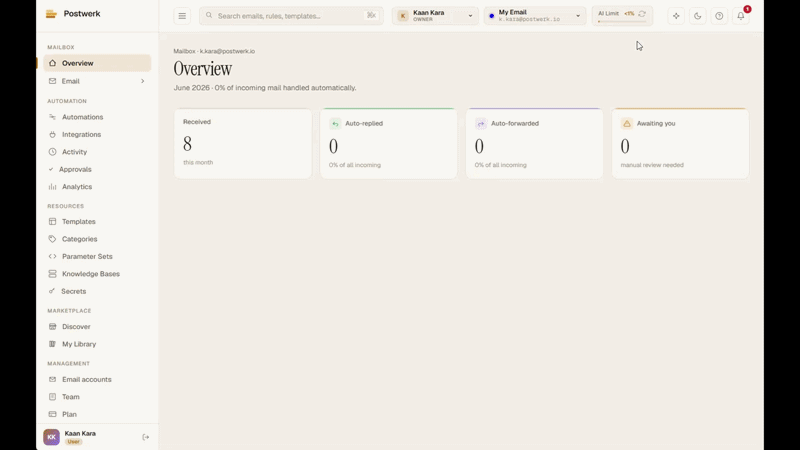
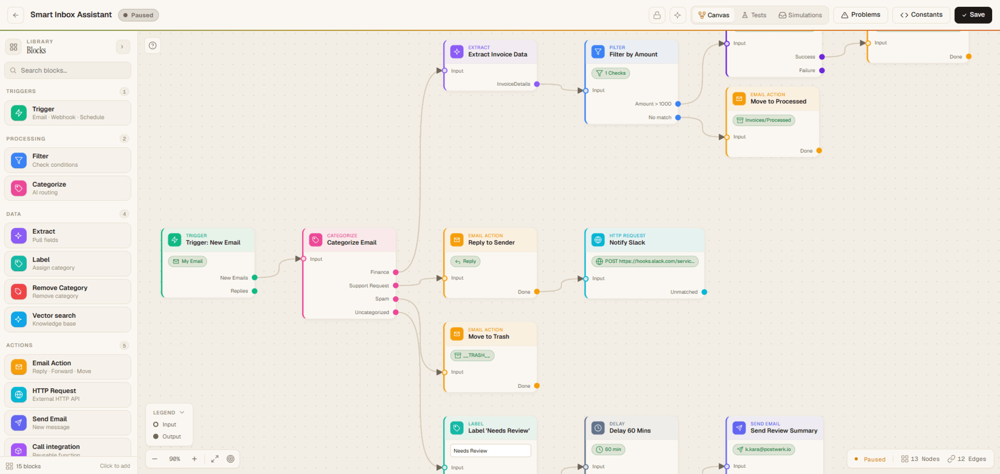
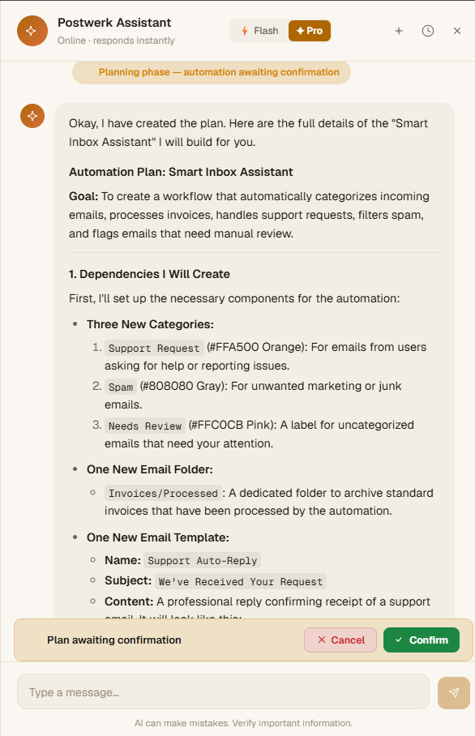
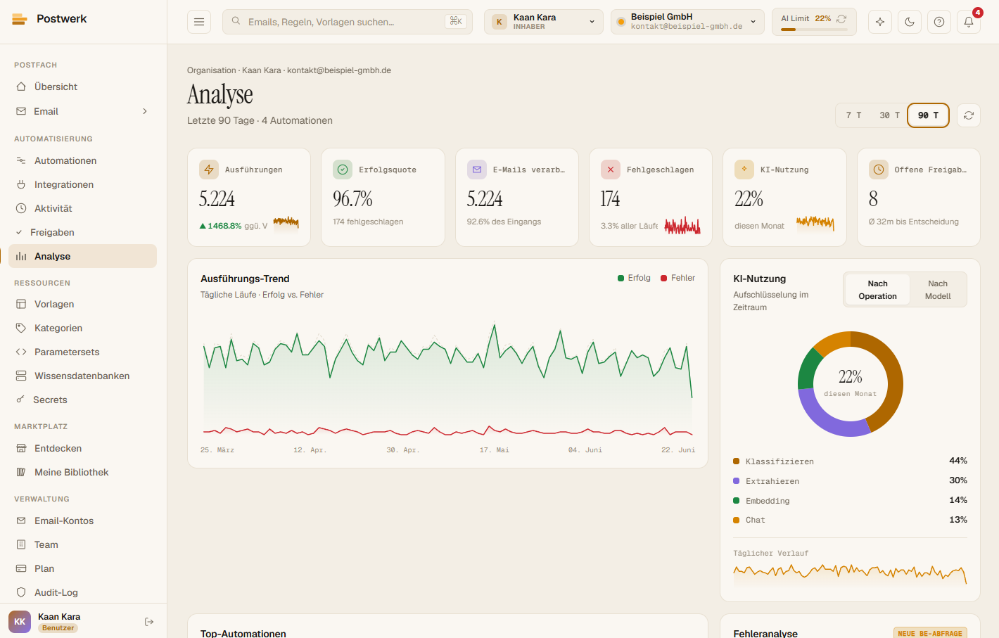

<h1>
  <picture>
    <source media="(prefers-color-scheme: dark)" srcset="frontend/public/logo-dark.svg" />
    
  </picture>
  &nbsp;Postwerk
</h1>

<p>
  <strong>AI-Powered Email Automation Platform</strong><br/>
  Build visual automation workflows that classify, extract, reply, forward, and act on your emails — powered by Google Gemini.
</p>

<p>
  🔗 <strong>Live:</strong> <a href="https://postwerk.io">postwerk.io</a> &nbsp;·&nbsp; <em>open beta</em>
</p>

<p>
  <a href="https://github.com/Kaandroids/Postwerk/actions/workflows/ci.yml"></a>
  <a href="https://github.com/Kaandroids/Postwerk/actions/workflows/deploy.yml"></a>
  <a href="https://codecov.io/gh/Kaandroids/Postwerk"></a>
</p>

<p>
  
  
  
  
  
  
  
  
  
</p>

<!-- HERO -->
<p align="center">
  
</p>
<p align="center"><em>Building & running an email automation with the AI assistant — no code.</em></p>

---

## Overview

Postwerk is a full-stack SaaS platform that lets users connect their email accounts and build powerful, AI-driven automation workflows through a visual drag-and-drop editor. Think Zapier meets Gmail, with built-in AI for email classification, structured data extraction, semantic knowledge-base search, and a conversational assistant that builds your workflows for you.

## Key Features

### Automation Engine
- **Node-based execution engine** — 15 node types: trigger, filter, AI categorize, AI extract, label / remove-label, email action (reply / forward / move), send email, delay, outbound webhook, vector search, integration call, and notify — plus input/output for reusable integrations
- **Supervised execution** — action nodes run in AUTO, REVIEW (human approves before any side effect), or OFF modes
- **Visual flow editor** — drag-and-drop canvas powered by Foblex Flow with real-time connection validation and a shared lint catalog (enforced on both backend and frontend)
- **Dry-run testing** — test automations with mock data before going live, with per-node trace inspection
- **API / webhook triggers** — invoke automations via REST or inbound webhooks with HMAC-SHA256 signature verification

### AI Integration (Google Gemini)
- **AI Assistant** — conversational chat that builds and modifies automations through natural language, with a planning → building phase machine and a tool registry
- **Email classification** — auto-categorize incoming emails against user-defined categories
- **Data extraction** — pull structured fields (dates, amounts, addresses, …) from email bodies into parameter sets
- **Knowledge base + semantic search** — org-scoped reference data searched with pgvector embeddings + full-text, fused via reciprocal rank fusion and an LLM match judge
- **Onboarding wizard** — a public, no-login conversational flow that produces a working automation

### Email Management
- **Multi-account IMAP/SMTP** — connect multiple email accounts with encrypted credential storage (AES-256-GCM)
- **Real-time sync** — scheduled IMAP polling with configurable intervals
- **Rich email composer** — TipTap-based WYSIWYG editor with attachments, templates, and parameter sets
- **Advanced filtering** — DNF-based filter system (OR between groups, AND within groups)
- **Folder management** — move, label, archive, trash operations via IMAP

### Platform
- **Multi-tenant architecture** — organizations as tenants; every domain (incl. billing) is org-scoped, with per-mailbox read/send grants
- **Role-based access control** — user/org roles + platform-staff RBAC, JWT authentication
- **Plan-based quotas** — cost-based AI usage tracking (STARTER / PRO / ENTERPRISE)
- **GDPR compliance** — automated data retention, account deletion, IP pseudonymization, audit logging
- **Admin dashboard** — user management, plan administration, AI usage analytics, system stats
- **Internationalization** — full German and English language support
- **Dark/Light theme** — system-aware theme switching with CSS custom properties

## Engineering Highlights

> Short on time? These are the parts I'd point a reviewer at first — where most of the interesting engineering lives.

- **DAG automation execution engine** — automations are graphs of typed nodes, each with its own processor/executor, run by a single engine rather than a switch statement. Supervised execution (AUTO / REVIEW / OFF), dry-run with per-node trace inspection, and reusable sub-flows ("integrations") invoked recursively with a depth guard.
  → [`AutomationExecutorServiceImpl`](backend/src/main/java/com/postwerk/service/impl/AutomationExecutorServiceImpl.java) · [`service/executor/`](backend/src/main/java/com/postwerk/service/executor/)
- **Conversational AI that builds automations** — a tool registry exposed to Google Gemini behind an `OPEN → PLANNING → BUILDING` phase machine, so write tools stay locked until the user confirms a plan.
  → [`AiToolRegistry`](backend/src/main/java/com/postwerk/service/AiToolRegistry.java) · [`ConversationPhaseManager`](backend/src/main/java/com/postwerk/service/ConversationPhaseManager.java)
- **Hybrid semantic search** — knowledge-base search fuses pgvector cosine similarity with Postgres full-text via **reciprocal rank fusion**, then an LLM match-judge applies a confidence threshold.
  → [`KnowledgeBaseSearchServiceImpl`](backend/src/main/java/com/postwerk/service/impl/KnowledgeBaseSearchServiceImpl.java)
- **One lint catalog, enforced on both sides** — backend (Java) and frontend (TypeScript) can't share code, so they share an issue-**code** vocabulary; the same validation rules gate the editor UI and block activation/publish server-side.
  → [`AutomationValidator`](backend/src/main/java/com/postwerk/service/AutomationValidator.java) (Java) · `automation-lint.service.ts` (TS)
- **Keyless, build-once CI/CD** — GitHub Actions builds each image once and ships it to production on merge with **zero long-lived cloud credentials**: it authenticates to GCP via Workload Identity Federation (OIDC), pushes to Artifact Registry, and deploys over an Identity-Aware Proxy SSH tunnel with health-gated auto-rollback.
  → [`deploy.yml`](.github/workflows/deploy.yml) · [`terraform/wif.tf`](terraform/wif.tf)

## Architecture

```
┌─────────────────────────────────────────────────────────┐
│                     Caddy (Reverse Proxy)                │
│              Automatic HTTPS (Let's Encrypt)              │
├────────────────────────┬────────────────────────────────┤
│                        │                                  │
│   ┌────────────────┐   │   ┌──────────────────────────┐  │
│   │   Angular 19   │   │   │    Spring Boot 3.4       │  │
│   │   (Frontend)   │◄──┼──►│     (REST API)           │  │
│   │                │   │   │                          │  │
│   │ • Standalone   │   │   │ • JWT Authentication     │  │
│   │   Components   │   │   │ • DAG Executor Engine    │  │
│   │ • Signals      │   │   │ • Gemini AI Integration  │  │
│   │ • Foblex Flow  │   │   │ • IMAP/SMTP Service      │  │
│   │ • SCSS Themes  │   │   │ • Circuit Breakers       │  │
│   └────────────────┘   │   └──────────┬───────────────┘  │
│                        │              │                    │
│                        │   ┌──────────┴───────────────┐  │
│                        │   │  PostgreSQL 17 + pgvector │  │
│                        │   │  Redis 7 (cache + rate)   │  │
│                        │   └──────────────────────────┘  │
└─────────────────────────────────────────────────────────┘
```

## Concurrency — current limitation

There's no queue or broker yet. Background work runs on Spring `@Scheduled` jobs, and
production is a single backend instance, so the jobs can't double-fire today. The hot path —
claiming an email and running its automations — is already idempotent on `(emailId, automationId)`
and the poller holds a Redis lock, but a couple of the lighter jobs have no such guard, so a race
becomes possible the moment a second instance exists. A conscious trade-off for an open beta,
not an oversight.

**If it needs to scale:** move the cron triggers to an external scheduler and let workers claim
each email row atomically in Postgres (a short lease / `SELECT … FOR UPDATE SKIP LOCKED`),
turning the DB into a competing-consumer queue — no broker to operate. Every layer here is
*at-least-once* on its own (the scheduler retries; a lease can be re-handed when a worker looks
dead but is only slow), so the idempotency key is what upgrades the **effect** to *exactly-once*.
True exactly-once delivery is impossible over SMTP/HTTP — at-least-once plus idempotency is how
you get there in practice.

## Tech Stack

| Layer | Technology |
|-------|-----------|
| **Frontend** | Angular 19, TypeScript, SCSS, Foblex Flow, TipTap Editor |
| **Backend** | Spring Boot 3.4, Java 21, Spring Security, Spring Data JPA |
| **Database** | PostgreSQL 17 with pgvector extension |
| **Cache** | Redis 7 (rate limiting, token blacklist, plan cache) |
| **AI** | Google Gemini API (2.5 Flash + 2.5 Pro) |
| **Observability** | Spring Boot Actuator, Micrometer, Prometheus, Structured JSON Logging |
| **Resilience** | Resilience4j (circuit breaker, retry, rate limiter) |
| **Infrastructure** | Docker Compose, Caddy (automatic HTTPS), GCP Compute Engine, Terraform, Google Secret Manager, Cloudflare DNS, Flyway |
| **CI / CD** | GitHub Actions (path-filtered CI · keyless deploy), Artifact Registry, Workload Identity Federation (OIDC), Identity-Aware Proxy |
| **Testing** | JUnit 5, Testcontainers, Playwright E2E, Vitest |

## Project Structure

```
Postwerk/
├── .github/workflows/          # CI + keyless deploy pipelines (GitHub Actions)
├── backend/                    # Spring Boot application
│   └── src/main/java/com/postwerk/
│       ├── config/             # Security, Redis, CORS, rate limiting
│       ├── controller/         # 30+ REST controllers
│       ├── service/            # Business logic (interfaces + implementations)
│       │   ├── impl/           # Service implementations
│       │   └── executor/       # per-node processor/executor classes
│       ├── repository/         # Spring Data JPA repositories
│       ├── model/              # JPA entities + enums
│       ├── dto/                # Request/Response records
│       ├── mapper/             # Entity ↔ DTO mappers
│       └── exception/          # Global exception handling
├── frontend/                   # Angular application
│   └── src/app/
│       ├── core/               # Singleton services, guards, interceptors
│       ├── shared/             # 15 reusable UI components
│       ├── features/           # Feature modules (auth, dashboard, landing)
│       └── models/             # TypeScript interfaces
├── docker/                     # Caddy, Nginx, PostgreSQL, Redis configs
├── terraform/                  # Infrastructure as Code (GCP)
├── deploy/                     # Deployment script
├── doc/                        # Design docs (multi-tenant, knowledge base, GDPR, …)
└── docker-compose.yml
```

## Getting Started

### Prerequisites

- Docker & Docker Compose
- Java 21 (for local backend development)
- Node.js 22 (for local frontend development)
- PostgreSQL 17 with pgvector
- Redis 7
- Google Gemini API key

### Quick Start (Docker)

```bash
# 1. Clone the repository
git clone https://github.com/Kaandroids/postwerk.git
cd postwerk

# 2. Copy environment template and fill in your values
cp .env.example .env

# 3. Start all services
docker compose up -d

# 4. Open the application
open http://localhost
```

### Local Development

```bash
# Backend
cd backend
./mvnw spring-boot:run -Dspring-boot.run.profiles=dev

# Frontend (separate terminal)
cd frontend
npm install
ng serve

# Open http://localhost:4200
```

### Running Tests

```bash
# Backend unit tests
cd backend && ./mvnw test

# Backend integration tests (requires Docker for Testcontainers)
cd backend && ./mvnw test -DexcludedGroups=""

# Frontend E2E tests
cd frontend && npx playwright test

# Frontend linting
cd frontend && ng lint
```

## CI/CD & Deployment

Every push runs CI; every merge to `main` ships to production automatically — with **no long-lived cloud credentials stored in GitHub**. Production runs on a single Google Compute Engine VM (Frankfurt) via Docker Compose behind Caddy.

```
 Pull request ─► CI (path-filtered) ─► CI OK gate ─► merge to main
                 backend · frontend                       │
                 tests · coverage · e2e                   │
                                                          ▼
     ┌──────────────────────────────────────────────────────────────┐
     │  Deploy — GitHub Actions, keyless via Workload Identity Fed.   │
     │                                                                │
     │  build  ─► images built ONCE ─► Artifact Registry             │
     │           (SHA-pinned + latest, layer-cached)                 │
     │  deploy ─► IAP-tunnelled SSH ─► VM pulls the pinned images    │
     │           ─► .env from Secret Manager ─► docker compose up    │
     │           ─► /api/v1/health ─► auto-rollback if unhealthy     │
     └──────────────────────────────────────────────────────────────┘
```

**CI** ([`ci.yml`](.github/workflows/ci.yml)) — path filters run only the affected area, so a docs-only change skips the heavy jobs; a single **`CI OK`** aggregate job is the one required status check, so path-skipped jobs never leave a PR stuck "waiting". Covers backend unit + Testcontainers integration tests, JaCoCo coverage, the Angular build, and Playwright E2E.

**CD** ([`deploy.yml`](.github/workflows/deploy.yml)) — fully automatic on merge to `main`:

- **Keyless auth** — GitHub authenticates to GCP with a short-lived OIDC token via **Workload Identity Federation**; no service-account key lives in the repo or in GitHub secrets.
- **Build once, deploy that exact artifact** — backend and frontend images are built in CI and pushed to **Artifact Registry**, SHA-pinned; the VM only ever *pulls* (it never builds), so deploys are fast, reproducible, and trivially rolled back.
- **No public SSH** — the runner reaches the VM through an **Identity-Aware Proxy** tunnel, so port 22 need not be exposed to the internet.
- **Safe rollout** — [`deploy/deploy.sh`](deploy/deploy.sh) materializes `.env` from Secret Manager, brings the stack up, polls `/api/v1/health`, and **auto-rolls-back** to the last-good image if the new one is unhealthy.

**Infrastructure as Code** — `terraform/` provisions the VM, a reserved static IP, a locked-down firewall, Artifact Registry, the Workload Identity pool/provider, and least-privilege service accounts; Terraform state lives remotely in GCS. Caddy terminates TLS with auto-renewed Let's Encrypt certificates and enforces security headers (HSTS, CSP, X-Frame-Options) at the edge.

```bash
# provision / update infrastructure
cd terraform && terraform init && terraform apply

# deploys happen automatically on merge to main;
# to roll out a specific build by hand (on the VM):
IMAGE_TAG=sha-<git-sha> ./deploy/deploy.sh
```

## API Overview

All endpoints are versioned under `/api/v1/` and documented with OpenAPI/Swagger.

| Module | Endpoints | Description |
|--------|-----------|-------------|
| **Auth** | `/api/v1/auth/**` | Register, login, refresh, logout, password reset |
| **Emails** | `/api/v1/emails/**` | List, search, read, sync, folder management |
| **Compose** | `/api/v1/compose/**` | Send, reply, forward, drafts, attachments |
| **Automations** | `/api/v1/automations/**` | CRUD, flow editor, test runner, execution history |
| **Categories** | `/api/v1/categories/**` | AI-powered email categorization |
| **Filters** | `/api/v1/filters/**` | DNF-based email filter rules |
| **Templates** | `/api/v1/templates/**` | Email template management |
| **AI Assistant** | `/api/v1/ai/**` | Chat, conversations, automation building |
| **Admin** | `/api/v1/admin/**` | User management, plans, stats, audit logs |
| **Health** | `/api/v1/health` | Application health check |

> Swagger UI available at `/swagger-ui.html` in development mode.

## Screenshots

**Visual automation editor** — drag-and-drop flow canvas


**AI assistant** — builds automations from natural language


**Dashboard** — overview & AI usage analytics


## Environment Variables

See [`.env.example`](.env.example) for the full list of required environment variables including:

- `JWT_SECRET` — JWT signing key
- `ENCRYPTION_KEY` — AES-256-GCM key for credential encryption
- `GEMINI_API_KEY` — Google Gemini API key
- `POSTGRES_*` — PostgreSQL host / db / user / password
- `REDIS_*` — Redis host / password
- `APP_PUBLIC_BASE_URL` — public base URL (email links, webhook URLs)
- `CORS_ALLOWED_ORIGINS` — Allowed frontend origins

## About

Postwerk is a solo-built, full-stack portfolio project — designed and implemented end to end: the Spring Boot backend, the Angular frontend, the AI automation engine, the multi-tenant data model, and the GCP deployment (Terraform · Caddy · keyless Secret Manager). It runs as an open beta at [postwerk.io](https://postwerk.io).

I built Postwerk to push on the parts of full-stack work that are easy to hand-wave and hard to actually ship: a real execution engine instead of a pile of `if`s, multi-tenant isolation that holds at the query level, AI wired into the product through a typed tool registry rather than bolted on, and a production deployment I own end to end. The pieces I enjoyed engineering most were the node execution engine and the planning→building phase machine that lets the assistant change a live automation safely.

## License

This project is licensed under the [MIT License](LICENSE).

## Contact

- **Live demo** — [postwerk.io](https://postwerk.io)
- **GitHub** — [@Kaandroids](https://github.com/Kaandroids)
- **LinkedIn** — [Kaan Kara](https://www.linkedin.com/in/kaan-kara-0a720439b)
- **Email** — [kaan403@icloud.com](mailto:kaan403@icloud.com)
